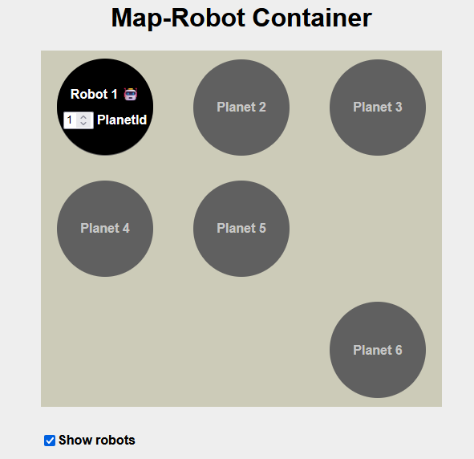

# README Map as Micro-Frontend Approach 2

This repository is a proof-of-concept for the second approach of the Map as Micro-Frontends.

In summary, the second approach involves having the robots as separate components that are positioned on the corresponding planets in the Planet Micro-Frontend by the Container application. In this case, this concept has been demonstrated with a single robot.

## Table of Contents
- [Installation](#installation)
- [On the first start of the project](#on-the-first-start-of-the-project)
- [To start the project automatically](#to-start-the-project-automatically)
- [To stop the project automatically](#to-stop-the-project-automatically)
- [Map Micro-Frontend](#map-micro-frontend)
- [Robot Micro-Frontend](#robot-micro-frontend)
- [Robot-Map Container](#robot-map-container)
- [Container](#container)
- [Functionality](#functionality)
- [Common Issues](#common-issues)


## Installation

To install the project, clone the repository and install the dependencies:

```bash
git clone https://github.com/sjannsen/MSD-Map-Approach-2.git
```
### On the first start of the project

```chmod +x init-dependencies.sh```

```./init.sh```

Run these commands in a terminal. This will install all dependencies. If you are using a Windows machine, you can use Git Bash to run the scripts.

### To start the project automatically:
```chmod +x start.sh```

```./start.sh start```

### To stop the project automatically
To stop the project automatically, you can run the start script with the appropriate argument:

```./start.sh stop```

To start the project manually, you need to run

```npm start```

in each of the following directories. Each application can then be stopped individually using the terminal exit command

## Using the application


After starting the applications, you should see the following:




Here you can see the four components of the application:

 - Robot-Micro-Frontend
 - Map-Micro-Frontend
 - Robot-Map-Container
 - Container

### Map Micro-Frontend
The Map Micro-Frontend renders the planets. It transmits the position of each planet to the Robot-Map Container.

### Robot Micro-Frontend

The Robot Micro-Frontend renders the robot(s). The current position of the robot can be adjusted using the input field on the robot. This position is then transmitted to the Robot-Map Container.

### Robot-Map Container
The Robot-Map Container is responsible for positioning the robot on the map. Unlike in the first approach, where the Map Frontend and Robot Frontend are simply overlaid, the position of the robot is dynamically controlled by the Robot-Map Container. It uses the planetId from the robot and searches for the position of this planet in the transmitted planets. The "Show robots" checkbox can be used to show or hide the robot application.

### Container
The Container is responsible for embedding and loading the Micro-Frontend applications.


## Functionality
The Robot-Map Container manages a list of planets and a list of robots. These are initialized when the Map Micro-Frontend application and the Robot Micro-Frontend application are mounted.


```js
root.component.tsx:
export default function Root(props) {
	const [planets, setPlanets] = useState([])
	const [robots, setRobots] = useState([])

	...

	let mapParcel: Parcel | null = null
	useEffect(() => {
		async function loadParcel() {
			const mapParcelConfig: ParcelConfig<{ domElement: any }> = await System.import(
				'@MEA/Map-Micro-Frontend',
			)

			mapParcel = mountRootParcel(mapParcelConfig, {
				domElement: mapParcelRef.current,
				// @ts-ignore
				addPlanets: setPlanets,
			})
		}
		loadParcel()

		return () => {
			if (mapParcel) mapParcel.unmount()
		}
	}, [])

	let robotParcel: Parcel | null = null
	useEffect(() => {
		async function loadParcel() {
			const parcelConfig: ParcelConfig<{ domElement: any }> = await System.import(
				'@MEA/Robot-Micro-Frontend',
			)

			robotParcel = mountRootParcel(parcelConfig, {
				domElement: robotParcelRef.current,
				// @ts-ignore
				addRobots: setRobots,
				positions: { id: 1, position: 'mid-center' },
			})
		}
		if (renderRobots ) loadParcel()

		return () => {
			if (robotParcel) robotParcel.unmount()
		}
	}, [renderRobots])

	...
}
```
[Robot-Map-Container/src/root.component.tsx](Robot-Map-Container/src/root.component.tsx)

After that, the Robot-Map-Container application renders the Map-Micro-Frontend. For the robot, the position of the planet corresponding to its planetId is searched in the Map-Micro-Frontend application and then placed accordingly.

```js
const getPositionOfPlanetByPlanetId = (id: number) => {
		const planetId = robots?.[0]?.planetId || undefined
		const planet = planets.find((planet) =>  planet.id == planetId)

        ...

		return planet.position
	}

return (
		<div className={'container'}>
			<h1>Map-Robot Container</h1>
			<div className="map-robot-wrapper">
				<div className="map-parcel" ref={mapParcelRef}></div>
				{renderRobots && (
					<div className="robot-orchestration-container">
						<div className={getPositionOfPlanetByPlanetId(robots.length > 0 ? robots[0].planetId : 1)} ref={robotParcelRef}></div>
					</div>
				)}
			</div>
			<div className="display-options-container">
				<input
					type="checkbox"
					name="show robots"
					value={'show robots value'}
					defaultChecked
					onChange={() => setRenderRobots(!renderRobots)}
				/>
				<label>Show robots</label>
			</div>
		</div>
	)
```
[Robot-Map-Container/src/root.component.tsx](Robot-Map-Container/src/root.component.tsx)

## Common Issues:
If any of the following ports are occupied, it can lead to problems:

 - 3000
 - 3001
 - 3002
 - 9000

In this case, the port of the affected application can be easily changed in the webpack.config.js under:

```js
  return merge(defaultConfig, {
    // modify the webpack config however you'd like to by adding to this object
    devServer: {
      port: 3001,
    },
  });
```
see e.g. [Robot-Micro-Frontend/webpack.config.js](Robot-Micro-Frontend/webpack.config.js)

Additionally, a change is needed in the Container application: In the index.ejs under:

```js
<script type="systemjs-importmap"> {
    "imports": {
        "@single-spa/welcome": "https://unpkg.com/single-spa-welcome/dist/single-spa-welcome.js",
        "@MEA/root-config": "//localhost:9000/MEA-root-config.js",
        "@MEA/Map-Micro-Frontend": "//localhost:3002/MEA-Map-Micro-Frontend.js",
        "@MEA/Robot-Map-Container": "//localhost:3000/MEA-Robot-Map-Container.js",
        "@MEA/Robot-Micro-Frontend": "//localhost:3001/MEA-Robot-Micro-Frontend.js"
        }
    }
</script>
```
[Container/src/index.ejs](Container/src/index.ejs)

the port of the corresponding application must also be adjusted.
